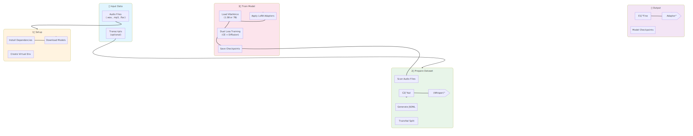
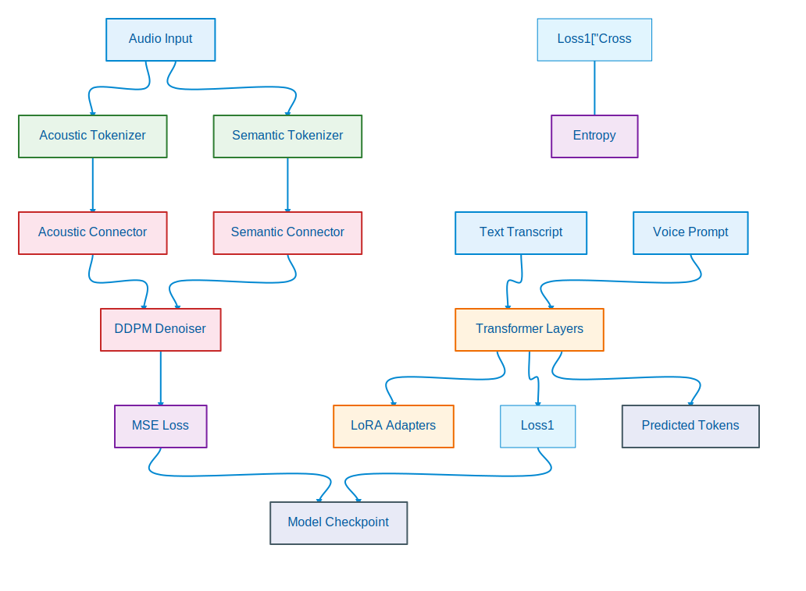
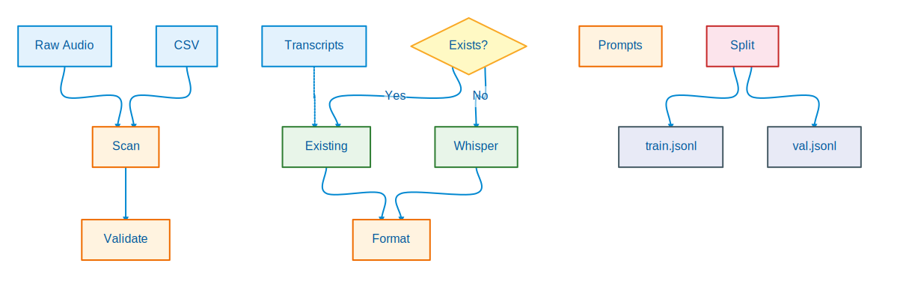

# VibeVoice Fine-tuning - Easy Scripts

Simplified scripts for fine-tuning VibeVoice models with LoRA. The goal is to make the process as painless as possible with reasonable defaults and clear instructions.



## Quick Start

### 1. Setup Environment

```bash
bash 01-setup.sh
```

This script will:
- Install system dependencies (ffmpeg, git-lfs, etc.)
- Create a Python virtual environment
- Clone the VibeVoice-finetuning repository
- Install all Python dependencies
- Download the VibeVoice model (1.5B or 7B)
- Create helper scripts

### 2. Prepare Your Dataset

```bash
source activate_env.sh
python 02-prepare_dataset.py --audio_dir /path/to/your/audio --auto-transcribe --output data/dataset.jsonl
```

Or with existing transcripts:
```bash
python 02-prepare_dataset.py --audio_dir /path/to/audio --transcript_dir /path/to/transcripts --output data/dataset.jsonl
```

### 3. Train the Model

```bash
python 03-train.py --dataset data/dataset.jsonl --model 1.5B
```

That's it! Your fine-tuned model will be saved in the `output/` directory.

---

## Architecture Overview



The VibeVoice model uses a dual-loss training approach:
- **Cross-Entropy Loss** on text tokens for language modeling
- **MSE Loss** on acoustic latents for speech generation quality

LoRA adapters are applied to the Qwen2 LLM backbone while the diffusion head can be fully fine-tuned.

---

## Detailed Documentation

### Script 1: Setup (`01-setup.sh`)

The setup script handles all environment setup automatically.

**What it does:**
1. Checks for CUDA availability
2. Installs system dependencies (Ubuntu/Debian, RHEL/CentOS, or macOS)
3. Creates a Python 3.11 virtual environment
4. Clones the VibeVoice-finetuning repository
5. Installs PyTorch with CUDA support
6. Installs the VibeVoice-finetuning package with compatible dependencies
7. Downloads your chosen model (1.5B or 7B)
8. Creates helper scripts (`activate_env.sh`)

**After setup:**
```bash
source activate_env.sh  # Activate the environment
```

---

### Script 2: Dataset Preparation (`02-prepare_dataset.py`)



This script prepares your audio data into the JSONL format required by VibeVoice.

#### Basic Usage

**Option 1: Auto-transcribe with Whisper**
```bash
python 02-prepare_dataset.py \
  --audio_dir ./my_audio \
  --auto-transcribe \
  --output data/dataset.jsonl
```

**Option 2: With transcript files**
```bash
python 02-prepare_dataset.py \
  --audio_dir ./my_audio \
  --transcript_dir ./transcripts \
  --output data/dataset.jsonl
```

**Option 3: From CSV**
```bash
python 02-prepare_dataset.py \
  --csv metadata.csv \
  --csv_audio_col audio_path \
  --csv_text_col transcript \
  --output data/dataset.jsonl
```

#### All Options

| Option | Description | Default |
|--------|-------------|---------|
| `--audio_dir` | Directory containing audio files | Required (or --csv) |
| `--csv` | CSV file with metadata | Alternative to --audio_dir |
| `--transcript_dir` | Directory with transcript .txt files | Auto-detect |
| `--auto_transcribe` | Transcribe audio using Whisper | False |
| `--whisper_model` | Whisper model size (tiny/base/small/medium/large) | base |
| `--voice_prompts_dir` | Directory with voice prompt audio | None |
| `--speaker_prefix` | Speaker label prefix | "Speaker 0" |
| `--output` | Output JSONL file | data/dataset.jsonl |
| `--val_split` | Validation split ratio | 0.1 (10%) |
| `--no_val_split` | Don't create validation set | False |

#### JSONL Format

The output file contains one JSON object per line:

```jsonl
{"text": "Speaker 0: Hello, this is a sample transcription.", "audio": "/path/to/audio.wav"}
{"text": "Speaker 0: Another example with voice prompt.", "audio": "/path/to/audio2.wav", "voice_prompts": "/path/to/prompt.wav"}
```

For multi-speaker training, include multiple voice prompts:
```jsonl
{"text": "Speaker 0: Hello there!\nSpeaker 1: Hi, how are you?", "audio": "/path/to/conversation.wav", "voice_prompts": ["/path/to/speaker0_prompt.wav", "/path/to/speaker1_prompt.wav"]}
```

---

### Script 3: Training (`03-train.py`)

A simplified training script with sensible defaults.

#### Basic Usage

**Quick test (1 epoch, faster)**
```bash
python 03-train.py --dataset data/dataset.jsonl --preset fast
```

**Standard training (1.5B model)**
```bash
python 03-train.py --dataset data/dataset.jsonl --model 1.5B
```

**High quality (7B model)**
```bash
python 03-train.py --dataset data/dataset.jsonl --model 7B --preset quality
```

**Resume from checkpoint**
```bash
python 03-train.py --dataset data/dataset.jsonl --resume_from_checkpoint ./output/checkpoint-500
```

#### Presets

| Preset | Description | Epochs | Learning Rate | Use Case |
|--------|-------------|--------|---------------|----------|
| `fast` | Quick training | 1 | 5e-5 | Testing the pipeline |
| `default` | Balanced | 5 | 2.5e-5 | General fine-tuning |
| `quality` | Best quality | 10 | 1e-5 | Production models |

#### Model Options

| Model | VRAM Required | Batch Size | Description |
|-------|---------------|------------|-------------|
| `1.5B` | 16GB | 4 | Smaller, faster training |
| `7B` | 48GB | 2 | Higher quality output |

#### All Options

| Option | Description | Default |
|--------|-------------|---------|
| `--dataset` | Training dataset JSONL file | Required |
| `--val_dataset` | Validation dataset JSONL | None |
| `--model` | Model size (1.5B/7B) | 1.5B |
| `--preset` | Training preset (fast/default/quality) | default |
| `--output_dir` | Output directory | output |
| `--num_epochs` | Number of epochs | From preset |
| `--learning_rate` | Learning rate | From preset |
| `--batch_size` | Batch size per device | From preset |
| `--gradient_accumulation` | Gradient accumulation steps | From preset |
| `--lora_r` | LoRA rank | 8 |
| `--lora_alpha` | LoRA alpha | 32 |
| `--wandb` | Enable Weights & Biases logging | False |
| `--tensorboard` | Enable TensorBoard logging | False |
| `--gradient_checkpointing` | Save memory (slower) | False |
| `--train_diffusion_head` | Train diffusion head | True |
| `--resume_from_checkpoint` | Resume from checkpoint path | None |

---

## Directory Structure

After setup, your directory will look like:

```
VibeVoice-finetune/
├── 01-setup.sh                 # Setup script
├── 02-prepare_dataset.py       # Dataset preparation
├── 03-train.py                 # Training script
├── activate_env.sh             # Environment activation
├── venv/                       # Python virtual environment
├── VibeVoice-finetuning/       # Original repository
├── models/                     # Downloaded models
│   ├── aoi-ot--VibeVoice-Base/
│   └── aoi-ot--VibeVoice-Large/
├── data/                       # Your data
│   ├── audio/                  # Audio files
│   ├── dataset.jsonl           # Prepared dataset
│   ├── dataset.train.jsonl     # Training split
│   └── dataset.val.jsonl       # Validation split
├── output/                     # Training outputs
│   ├── checkpoint-XXX/         # Checkpoints
│   └── lora/                   # Final LoRA adapter
├── docs/
│   └── diagrams/               # Documentation diagrams
│       ├── workflow-overview.svg
│       ├── architecture.svg
│       └── dataset-pipeline.svg
└── hf_cache/                   # HuggingFace cache
```

---

## Complete Example Workflow

```bash
# 1. Setup everything
bash 01-setup.sh

# 2. Activate environment
source activate_env.sh

# 3. Copy your audio files
cp -r /path/to/my/audio/* data/audio/

# 4. Prepare dataset (with Whisper transcription)
python 02-prepare_dataset.py \
  --audio_dir data/audio \
  --auto_transcribe \
  --whisper_model base \
  --output data/my_dataset.jsonl

# 5. Train the model
python 03-train.py \
  --dataset data/my_dataset.jsonl \
  --model 1.5B \
  --preset default \
  --output_dir output/my_model

# 6. Your model is ready!
# LoRA adapter saved at: output/my_model/lora/
```

---

## Tips & Best Practices

### Audio Quality
- Use high-quality audio files (24kHz sample rate preferred)
- Clean audio with minimal background noise works best
- Consistent volume levels across samples

### Dataset Size
- **Minimum**: 50-100 samples for minimal fine-tuning
- **Good**: 500-1000 samples for decent quality
- **Excellent**: 5000+ samples for best results

### Training Time Estimates

| Model | Dataset Size | Preset | Estimated Time (A100) |
|-------|--------------|--------|----------------------|
| 1.5B  | 100 samples  | fast   | ~5 minutes |
| 1.5B  | 1000 samples | default| ~2 hours |
| 7B    | 1000 samples | default| ~6 hours |
| 7B    | 5000 samples | quality| ~30 hours |

### Memory Optimization

If you run out of VRAM:

1. **Enable gradient checkpointing:**
   ```bash
   python 03-train.py --dataset data/dataset.jsonl --gradient_checkpointing
   ```

2. **Reduce batch size:**
   ```bash
   python 03-train.py --dataset data/dataset.jsonl --batch_size 1 --gradient_accumulation 64
   ```

3. **Use smaller model:**
   ```bash
   python 03-train.py --dataset data/dataset.jsonl --model 1.5B
   ```

### Multi-Speaker Training

For multi-speaker datasets:

1. Format your text with speaker labels:
   ```
   Speaker 0: First speaker's text
   Speaker 1: Second speaker's text
   ```

2. Provide voice prompts for each speaker:
   ```bash
   python 02-prepare_dataset.py \
     --audio_dir data/multi_speaker \
     --voice_prompts_dir data/prompts \
     --output data/multi_speaker.jsonl
   ```

---

## Troubleshooting

### Import Errors
Make sure you've activated the environment:
```bash
source activate_env.sh
```

### CUDA Out of Memory
- Use `--gradient_checkpointing`
- Reduce `--batch_size`
- Use a smaller model (1.5B instead of 7B)

### Model Not Found
The setup script should download models automatically. If not:
```bash
mkdir -p models
cd models
git lfs install
git clone https://huggingface.co/aoi-ot/VibeVoice-Base
git clone https://huggingface.co/aoi-ot/VibeVoice-Large
```

### Audio Loading Errors
Make sure ffmpeg is installed:
```bash
# Ubuntu/Debian
sudo apt-get install ffmpeg

# macOS
brew install ffmpeg
```

---

## Credits

- Original VibeVoice: [Microsoft VibeVoice](https://github.com/microsoft/VibeVoice)
- Fine-tuning repository: [VibeVoice-finetuning](https://github.com/voicepowered-ai/VibeVoice-finetuning)
- LoRA implementation: [PEFT](https://github.com/huggingface/peft)

## License

This wrapper script is provided as-is for easier use of VibeVoice fine-tuning. Please refer to the original repositories for their respective licenses.
